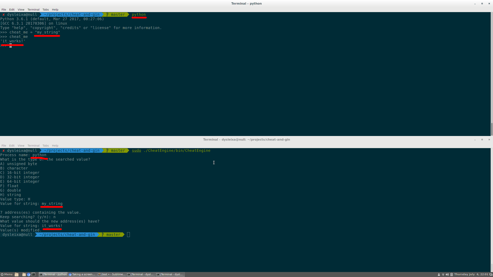

# Cheat Engine (Memory Scanner)

[](https://travis-ci.org/JesseEmond/cheat-and-gin)

`cheat-and-gin` is a program that you can use to modify the memory of another process while it is running.

Such a program is popular for hacking games that are running locally, but I build one to get familiar
with the particularities of modifying a program's memory under Window and Linux for learning purposes.

## Examples

### Minecraft
Here's an example where we give ourselves `999` dirt blocks by using an old version
of the cheat engine (the 999 blocks could actually be *placed*!):


Now all you have to do is find `1` diamond to *actually* find `999`...

*I don't actually encourage cheating in `Minecraft`. This is more of an
interesting real test for a cheat engine... Please don't use this in
multiplayer.*

### Python REPL
Here's an example where we modify the value of a string variable in a python
REPL interprer. We can do the same with integers, for example.


## Building
I use `premake4` for build configuration. You can find a download link on [premake's website](https://premake.github.io).

### Windows
To create a `Visual Studio` solution, use:
```
premake4 vs2017
```
You can then build in the solution.

### Linux
To create a GNU Makefile and compile, run:
```sh
premake4 gmake
cd build
make
```

## Cheating
### Our Target
There is a provided program named `FakeGame` which shows some fake game parameters (health, mana, gold, ...)
which change every time a newline is entered along with their associated addresses:
```
> ./FakeGame/bin/FakeGame
health(4): 100 - 0x7ffcb173c07c
mana(4): 100 - 0x7ffcb173c078
gold(1):   - 0x7ffcb173c077
miles(2): 5 - 0x7ffcb173c074
rate(4): 0.1 - 0x7ffcb173c070
science(8): 0.1 - 0x7ffcb173c068
```

### Our Attack
We can then start our cheat engine and specify the name of the process that we want to attack.
Note that we're playing with another process' memory, so we need extra rights. I am doing so by
running with `sudo` here:
```
> sudo ./CheatEngine/bin/CheatEngine
Process name: FakeGame
```

We enter `FakeGame` and we are then prompted to know the size of the variable that we want to modify:
```
What is the type of the searched value?
A) unsigned byte
B) character
C) 16-bit integer
D) 32-bit integer
E) 64-bit integer
F) float
G) double
H) string
Value type: D
```

Say that we want to modify the `health` (`4` bytes), we enter the choice of `32-bit integer`.

We are then asked for the current value of the target variable:
```
Value for 32-bit integer: 100
```

We enter the observed `100`. We are told that multiple addresses hold our value:
```
10 memory address(es) containing the value.
Keep searching? (y/n): y
``` 
We want to pin down our address, so we'll update our game (`newline` in our `FakeGame` process)
and keep searching with the updated value. Let's start by updating the game:
```
health(4): 99 - 0x7ffd647d71ac
mana(4): 98 - 0x7ffd647d71a8
gold(1): ! - 0x7ffd647d71a7
miles(2): 15 - 0x7ffd647d71a4
rate(4): 0.3 - 0x7ffd647d71a0
science(8): 0.103 - 0x7ffd647d7198
```

We can then enter the updated value (`99`):
```
Value for 32-bit integer: 99
```

Set a new value:
```
What value should the new address(es) have?
Value for 32-bit integer: 424242
Value(s) modified.
```

Finally, we can admire the results of our cheat by updating the `FakeGame`:
```
health(4): 424241 - 0x7ffd3d5b7c5c
mana(4): 96 - 0x7ffd3d5b7c58
(...)
```

## Running Tests
```sh
./CheatEngine/tests/bin/Tests
```
